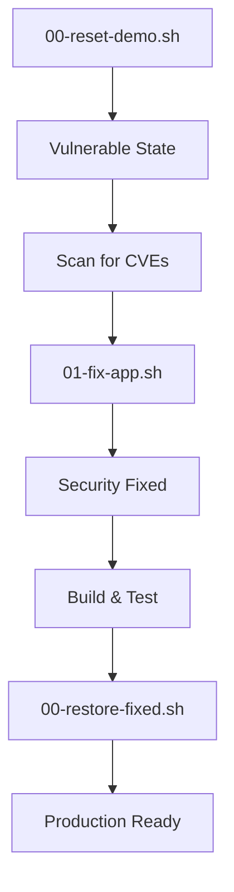

# Demo Summary: Vulnerability Reset & Management Workflow

## Created Scripts

### 🔄 **00-reset-demo.sh** 
**Purpose**: Reset POM to Original Vulnerable State
- Restores `pom.xml` to baseline state with known CVEs
- Creates backup of current security-fixed POM
- Enables demonstration of vulnerability discovery and remediation process
- Shows dependency versions with security issues

**Key Features**:
- Interactive confirmation before reset
- Backup creation for safety
- Compilation validation after reset
- Optional vulnerability scanning
- Clear warning about introducing CVEs

### 🛡️ **00-restore-fixed.sh**
**Purpose**: Restore POM to Security-Fixed State  
- Restores `pom.xml` to security-patched state
- Applies all CVE fixes (Tomcat 10.1.48, Logback 1.5.20, Spring 6.2.11)
- Validates functionality with testing
- Demonstrates "after" security posture

**Key Features**:
- Restores from backup created by reset script
- Compilation and test validation
- Security status verification
- Production-ready configuration

### 📚 **Enhanced demos/README.md**
**Purpose**: Comprehensive Demo Documentation
- Complete demo workflow documentation
- Learning objectives for each demo
- Recommended execution sequence
- Security best practices guide

## Demo Workflow



## Key Educational Value

### 🎯 **Vulnerability Lifecycle Demonstration**
1. **Before State**: Clean POM with default Spring Boot dependencies (vulnerable)
2. **Discovery**: Using Maven tools to identify outdated/vulnerable components  
3. **Remediation**: Applying targeted security patches
4. **Validation**: Ensuring fixes don't break functionality
5. **After State**: Secure POM with latest patched versions

### 🔍 **Specific CVE Examples**
- **Tomcat**: 10.1.44 → 10.1.48 (addressing potential embed-core vulnerabilities)
- **Logback**: 1.5.19 → 1.5.20 (addressing recent logging vulnerabilities)
- **Spring**: Default → 6.2.11 (ensuring latest security patches)

### 💡 **Learning Outcomes**
- How to identify vulnerable dependencies in Maven projects
- Safe incremental patching strategies vs major version jumps
- Importance of testing after security updates
- Automation of vulnerability management workflows

## Usage Examples

### Basic Demo Flow
```bash
# Start with vulnerable state
./demos/00-reset-demo.sh

# Apply fixes
./demos/01-fix-app.sh

# Restore to secure state when done
./demos/00-restore-fixed.sh
```

### Educational Presentation Flow
```bash
# 1. Show current secure state
mvn dependency:list | grep -E "(tomcat|logback)"

# 2. Reset to vulnerable baseline  
./demos/00-reset-demo.sh

# 3. Demonstrate vulnerability scanning
mvn versions:display-dependency-updates

# 4. Apply comprehensive fixes
./demos/01-fix-app.sh

# 5. Compare before/after
./demos/00-compare-images.sh

# 6. Test with containers
./demos/03-testcontainers.sh
```

## File Artifacts Created

```
demos/
├── 00-reset-demo.sh              # NEW: Reset to vulnerable state
├── 00-restore-fixed.sh           # NEW: Restore to fixed state
├── pom-original.xml              # NEW: Baseline vulnerable POM
├── pom-fixed-backup.xml          # AUTO: Created during reset
└── README.md                     # UPDATED: Comprehensive documentation
```

## Integration with Existing Infrastructure

✅ **Complements existing demos**:
- Works with existing `01-fix-app.sh` vulnerability fixing script
- Integrates with DHI monitoring demos
- Supports Testcontainers integration testing
- Enables complete security workflow demonstration

✅ **Maintains compatibility**:
- All existing functionality preserved
- No breaking changes to current workflows
- Additive security demonstration capabilities

This creates a complete, interactive demonstration environment for teaching supply chain security, vulnerability management, and DevSecOps best practices using real Maven dependency CVEs and remediation workflows.